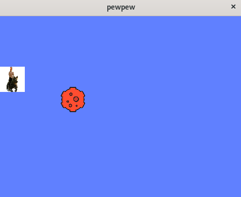

<div id="top"></div>


<!-- PROJECT LOGO -->
<br />
<div align="center">
    

<h3 align="center">PROJET RUNNER</h3>

  <p align="center">
    Jeu en 2D sur une interface graphique, où l'on contrôle un personnage qui ne doit pas se faire toucher par l'ennemi sous peine de gameover.
    <br />
  </p>
</div>


<!-- TABLE OF CONTENTS -->
<details>
  <summary>Table des matières</summary>
  <ol>
    <li>
      <a href="#technologies-utilisées">Technologies utilisées</a>
    </li>
    <li>
      <a href="#installation">Comment installer le projet</a>
      </li>
    <li>
      <a href="#comment-jouer">Comment jouer au jeu</a>
    </li>
  </ol>
</details>


### Technologies Utilisées

* [C](https://www.learn-c.org)
* [SDL2](https://www.libsdl.org/download-2.0.php)


### Installation

1. Cloner le repository.
   
2. Entrer dans le repository.
    ```sh
    cd <nom du dossier>
    ```

3. Installer tous les paquets nécessaires.
   ```sh
    sudo apt-get install libsdl2-2.0-0  libsdl2-ttf-2.0-0 libghc-sdl2-ttf-dev  libghc-sdl2-dev  libsdl2-dev libsdl2-gfx-1.0-0 libsdl2-gfx-dev libsdl2-image-2.0-0 libsdl2-image-dev libsdl2-mixer-2.0-0  libsdl2-mixer-dev  libsdl2-net-2.0-0  libsdl2-net-dev
    ```

4. Lancer cette commande pour installer les paramètres.
    ```sh
    make
    ```

5. Maintenant vous pouvez lancer le jeu avec la commande suivante .
   ```sh
   ./PEWPEW
   ```
   


<!-- COMMENT JOUER -->
## Comment Jouer

Les touches sont très simples : 

Il suffit d'utiliser votre touche "flèche du haut" pour faire monter le personnage, ainsi qu'utiliser la touche "flèche du bas" pour le faire descendre.


### Visuel du Jeu : 
<div align="center">
  
</div>

<p align="right">(<a href="#top">Revenir en haut</a>)</p>